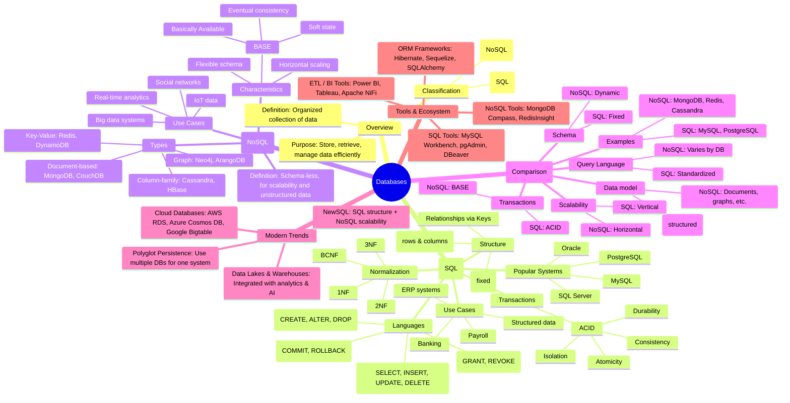
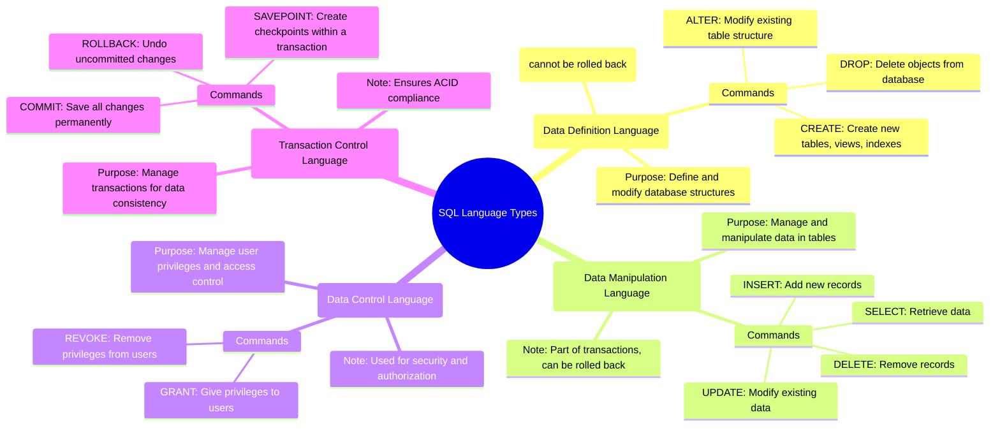

```mermaid
mindmap
  root((Databases))
    Overview
      Definition: Organized collection of data
      Purpose: Store, retrieve, manage data efficiently
      Classification
        Relational (SQL)
        Non-Relational (NoSQL)

    Relational Databases (SQL)
      Structure
        Tables (rows & columns)
        Schema (fixed)
        Relationships via Keys
      Languages
        DDL (CREATE, ALTER, DROP)
        DML (SELECT, INSERT, UPDATE, DELETE)
        DCL (GRANT, REVOKE)
        TCL (COMMIT, ROLLBACK)
      Normalization
        1NF
        2NF
        3NF
        BCNF
      Transactions
        ACID
          Atomicity
          Consistency
          Isolation
          Durability
      Popular Systems
        MySQL
        PostgreSQL
        Oracle
        SQL Server
      Use Cases
        Structured data
        Banking
        ERP systems
        Payroll

    Non-Relational Databases (NoSQL)
      Definition: Schema-less, for scalability and unstructured data
      Types
        Document-based: MongoDB, CouchDB
        Key-Value: Redis, DynamoDB
        Column-family: Cassandra, HBase
        Graph: Neo4j, ArangoDB
      Characteristics
        Flexible schema
        BASE
          Basically Available
          Soft state
          Eventual consistency
        Horizontal scaling
      Use Cases
        Real-time analytics
        IoT data
        Social networks
        Big data systems

    SQL vs NoSQL (Comparison)
      Data model
        SQL: Tables (structured)
        NoSQL: Documents, graphs, etc.
      Schema
        SQL: Fixed
        NoSQL: Dynamic
      Scalability
        SQL: Vertical
        NoSQL: Horizontal
      Transactions
        SQL: ACID
        NoSQL: BASE
      Query Language
        SQL: Standardized
        NoSQL: Varies by DB
      Examples
        SQL: MySQL, PostgreSQL
        NoSQL: MongoDB, Redis, Cassandra

    Modern Trends
      NewSQL: SQL structure + NoSQL scalability
      Polyglot Persistence: Use multiple DBs for one system
      Cloud Databases: AWS RDS, Azure Cosmos DB, Google Bigtable
      Data Lakes & Warehouses: Integrated with analytics & AI

    Tools & Ecosystem
      SQL Tools: MySQL Workbench, pgAdmin, DBeaver
      NoSQL Tools: MongoDB Compass, RedisInsight
      ORM Frameworks: Hibernate, Sequelize, SQLAlchemy
      ETL / BI Tools: Power BI, Tableau, Apache NiFi
```

```mermaid
mindmap
  root((SQL Language Types))
    DDL (Data Definition Language)
      Purpose: Define and modify database structures
      Commands
        CREATE: Create new tables, views, indexes
        ALTER: Modify existing table structure
        DROP: Delete objects from database
      Note: Auto-committed (cannot be rolled back)

    DML (Data Manipulation Language)
      Purpose: Manage and manipulate data in tables
      Commands
        SELECT: Retrieve data
        INSERT: Add new records
        UPDATE: Modify existing data
        DELETE: Remove records
      Note: Part of transactions, can be rolled back

    DCL (Data Control Language)
      Purpose: Manage user privileges and access control
      Commands
        GRANT: Give privileges to users
        REVOKE: Remove privileges from users
      Note: Used for security and authorization

    TCL (Transaction Control Language)
      Purpose: Manage transactions for data consistency
      Commands
        COMMIT: Save all changes permanently
        ROLLBACK: Undo uncommitted changes
        SAVEPOINT: Create checkpoints within a transaction
      Note: Ensures ACID compliance

```