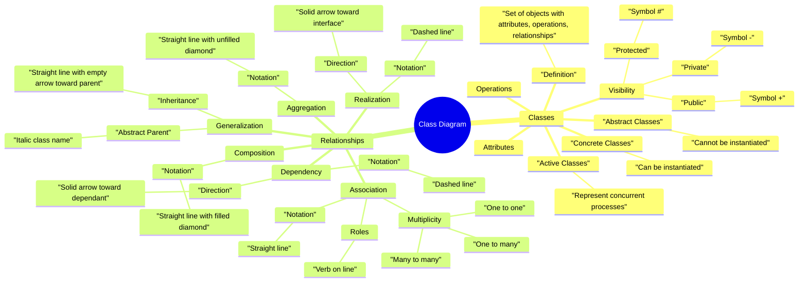

## State

```mermaid
mindmap
  root((Class Diagram))
    Classes
      "Definition"
        "Set of objects with attributes, operations, relationships"
      Attributes
      Operations
      Visibility
        "Public"
          "Symbol +"
        "Private"
          "Symbol -"
        "Protected"
          "Symbol #"
      "Abstract Classes"
        "Cannot be instantiated"
      "Concrete Classes"
        "Can be instantiated"
      "Active Classes"
        "Represent concurrent processes"
    Relationships
      Association
        "Notation"
          "Straight line"
        Multiplicity
          "One to one"
          "One to many"
          "Many to many"
        Roles
          "Verb on line"
      Aggregation
        "Notation"
          "Straight line with unfilled diamond"
      Composition
        "Notation"
          "Straight line with filled diamond"
      Generalization
        "Inheritance"
          "Straight line with empty arrow toward parent"
        "Abstract Parent"
          "Italic class name"
      Dependency
        "Notation"
          "Dashed line"
        "Direction"
          "Solid arrow toward dependant"
      Realization
        "Notation"
          "Dashed line"
        "Direction"
          "Solid arrow toward interface"
```
---

## Additional things
