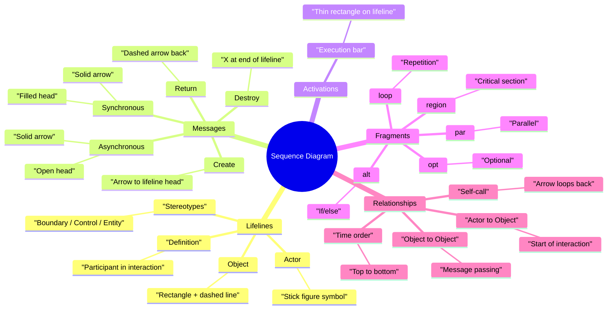
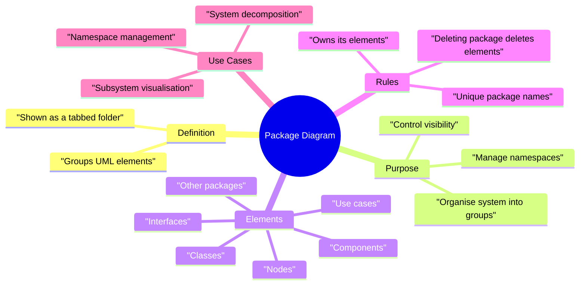

## Sequece

```mermaid
mindmap
  root((Sequence Diagram))
    Lifelines
      "Definition"
        "Participant in interaction"
      Actor
        "Stick figure symbol"
      Object
        "Rectangle + dashed line"
      "Stereotypes"
        "Boundary / Control / Entity"
    Messages
      Synchronous
        "Solid arrow"
        "Filled head"
      Asynchronous
        "Solid arrow"
        "Open head"
      Return
        "Dashed arrow back"
      Create
        "Arrow to lifeline head"
      Destroy
        "X at end of lifeline"
    Activations
      "Execution bar"
        "Thin rectangle on lifeline"
    Fragments
      alt
        "If/else"
      loop
        "Repetition"
      opt
        "Optional"
      par
        "Parallel"
      region
        "Critical section"
    Relationships
      "Time order"
        "Top to bottom"
      "Actor to Object"
        "Start of interaction"
      "Object to Object"
        "Message passing"
      "Self-call"
        "Arrow loops back"

```

---
## Package

```mermaid
mindmap
  root((Package Diagram))
    Definition
      "Groups UML elements"
      "Shown as a tabbed folder"
    Purpose
      "Organise system into groups"
      "Control visibility"
      "Manage namespaces"
    Elements
      "Classes"
      "Interfaces"
      "Components"
      "Nodes"
      "Use cases"
      "Other packages"
    Rules
      "Unique package names"
      "Owns its elements"
      "Deleting package deletes elements"
    Use Cases
      "System decomposition"
      "Subsystem visualisation"
      "Namespace management"


```

---

## Additional things

### Functor
- is an object of a struct/class that acts like a function due to operation() overloading