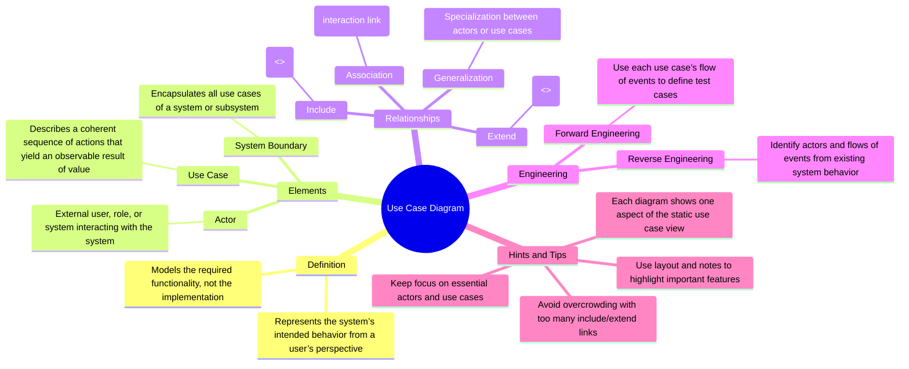
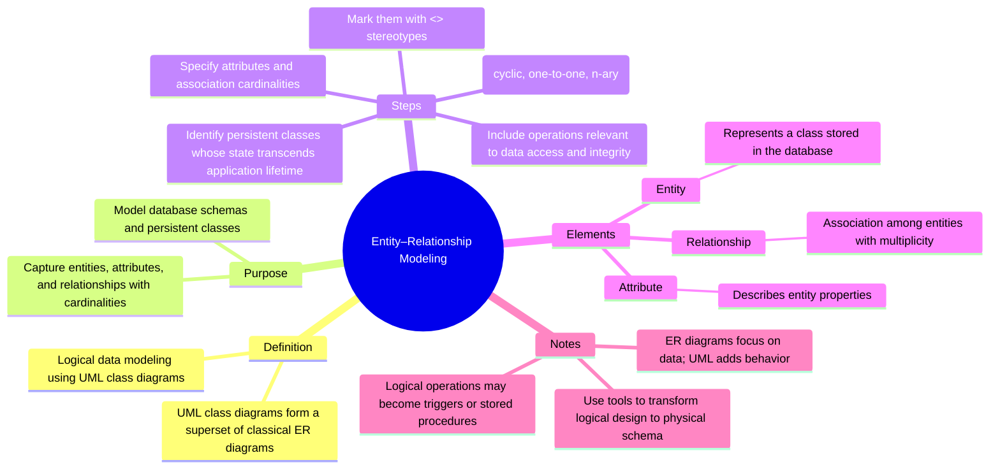

```mermaid
mindmap
  root((Use Case Diagram))
    Definition
      Represents the system’s intended behavior from a user’s perspective
      Models the required functionality, not the implementation
    Elements
      Actor
        External user, role, or system interacting with the system
      Use Case
        Describes a coherent sequence of actions that yield an observable result of value
      System Boundary
        Encapsulates all use cases of a system or subsystem
    Relationships
      Association
        Connects an actor and a use case (interaction link)
      Include
        Shows a common reusable behavior (<<include>>)
      Extend
        Shows optional or conditional behavior (<<extend>>)
      Generalization
        Specialization between actors or use cases
    Engineering
      Forward Engineering
        Use each use case’s flow of events to define test cases
      Reverse Engineering
        Identify actors and flows of events from existing system behavior
    Hints and Tips
      Each diagram shows one aspect of the static use case view
      Keep focus on essential actors and use cases
      Avoid overcrowding with too many include/extend links
      Use layout and notes to highlight important features
```
---

```mermaid

mindmap
  root((Entity–Relationship Modeling))
    Definition
      Logical data modeling using UML class diagrams
      UML class diagrams form a superset of classical ER diagrams
    Purpose
      Model database schemas and persistent classes
      Capture entities, attributes, and relationships with cardinalities
    Steps
      Identify persistent classes whose state transcends application lifetime
      Mark them with <<persistent>> stereotypes
      Specify attributes and association cardinalities
      Simplify complex associations (cyclic, one-to-one, n-ary)
      Include operations relevant to data access and integrity
    Elements
      Entity
        Represents a class stored in the database
      Attribute
        Describes entity properties
      Relationship
        Association among entities with multiplicity
    Notes
      ER diagrams focus on data; UML adds behavior
      Logical operations may become triggers or stored procedures
      Use tools to transform logical design to physical schema

```

---

## Additional things

### QA
- How does interface appear in erDiagram?