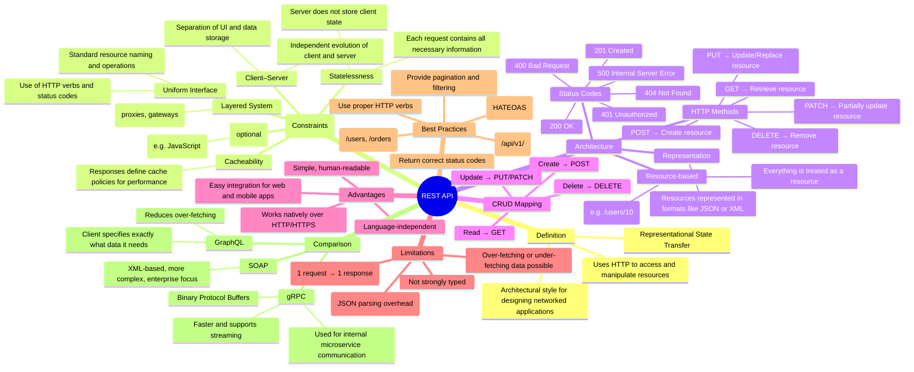

```mermaid
mindmap
  root((REST API))
    Definition
      Representational State Transfer
      Architectural style for designing networked applications
      Uses HTTP to access and manipulate resources
    Core Principles (Constraints)
      Client–Server
        Separation of UI and data storage
        Independent evolution of client and server
      Statelessness
        Each request contains all necessary information
        Server does not store client state
      Cacheability
        Responses define cache policies for performance
      Uniform Interface
        Standard resource naming and operations
        Use of HTTP verbs and status codes
      Layered System
        Client unaware of intermediate layers (proxies, gateways)
      Code-on-Demand (optional)
        Server can send executable code to client (e.g. JavaScript)
    Architecture
      Resource-based
        Everything is treated as a resource
        Identified by unique URI (e.g. /users/10)
      Representation
        Resources represented in formats like JSON or XML
      HTTP Methods
        GET → Retrieve resource
        POST → Create resource
        PUT → Update/Replace resource
        PATCH → Partially update resource
        DELETE → Remove resource
      Status Codes
        200 OK
        201 Created
        400 Bad Request
        401 Unauthorized
        404 Not Found
        500 Internal Server Error
    CRUD Mapping
      Create → POST
      Read → GET
      Update → PUT/PATCH
      Delete → DELETE
    Advantages
      Simple, human-readable
      Language-independent
      Works natively over HTTP/HTTPS
      Easy integration for web and mobile apps
    Limitations
      Slower than binary protocols (JSON parsing overhead)
      No native streaming (1 request → 1 response)
      Not strongly typed
      Over-fetching or under-fetching data possible
    Best Practices
      Use plural nouns for resources (/users, /orders)
      Use proper HTTP verbs
      Return correct status codes
      Provide pagination and filtering
      Use versioning (/api/v1/)
      Include hypermedia links (HATEOAS)
    Comparison
      SOAP
        XML-based, more complex, enterprise focus
      gRPC
        Binary Protocol Buffers
        Faster and supports streaming
        Used for internal microservice communication
      GraphQL
        Client specifies exactly what data it needs
        Reduces over-fetching

```