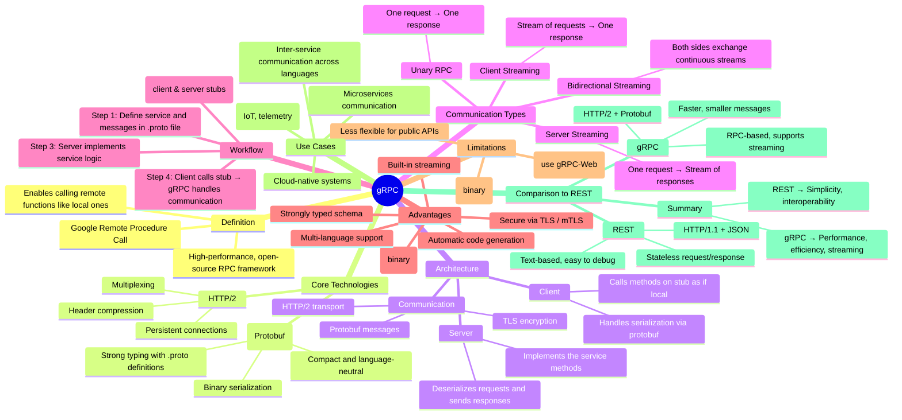

```mermaid
mindmap
  root((gRPC))
    Definition
      Google Remote Procedure Call
      High-performance, open-source RPC framework
      Enables calling remote functions like local ones
    Core Technologies
      HTTP/2
        Multiplexing
        Header compression
        Persistent connections
      Protocol Buffers (Protobuf)
        Binary serialization
        Compact and language-neutral
        Strong typing with .proto definitions
    Architecture
      Client
        Calls methods on stub as if local
        Handles serialization via protobuf
      Server
        Implements the service methods
        Deserializes requests and sends responses
      Communication
        HTTP/2 transport
        Protobuf messages
        TLS encryption
    Communication Types
      Unary RPC
        One request → One response
      Server Streaming
        One request → Stream of responses
      Client Streaming
        Stream of requests → One response
      Bidirectional Streaming
        Both sides exchange continuous streams
    Workflow
      Step 1: Define service and messages in .proto file
      Step 2: Generate code (client & server stubs)
      Step 3: Server implements service logic
      Step 4: Client calls stub → gRPC handles communication
    Advantages
      High performance (binary)
      Strongly typed schema
      Multi-language support
      Built-in streaming
      Automatic code generation
      Secure via TLS / mTLS
    Limitations
      Harder to debug (binary)
      Limited browser support (use gRPC-Web)
      Less flexible for public APIs
    Use Cases
      Microservices communication
      Real-time streaming (IoT, telemetry)
      Inter-service communication across languages
      Cloud-native systems
    Comparison to REST
      REST
        HTTP/1.1 + JSON
        Stateless request/response
        Text-based, easy to debug
      gRPC
        HTTP/2 + Protobuf
        RPC-based, supports streaming
        Faster, smaller messages
      Summary
        REST → Simplicity, interoperability
        gRPC → Performance, efficiency, streaming
```