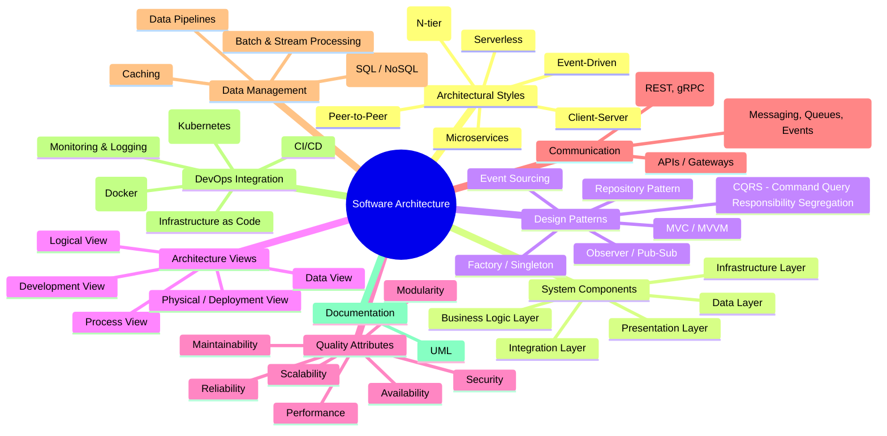

```mermaid
mindmap
  root((Software Architecture))
    Architectural Styles
      Layered (N-tier)
      Client-Server
      Microservices
      Event-Driven
      Serverless
      Peer-to-Peer
    System Components
      Presentation Layer
      Business Logic Layer
      Data Layer
      Integration Layer
      Infrastructure Layer
    Design Patterns
      MVC / MVVM
      Repository Pattern
      Factory / Singleton
      Observer / Pub-Sub
      CQRS - Command Query Responsibility Segregation
      Event Sourcing
    Architecture Views
      Logical View
      Development View
      Process View
      Physical / Deployment View
      Data View
    Quality Attributes
      Scalability
      Performance
      Security
      Maintainability
      Reliability
      Availability
      Modularity
    Communication
      Synchronous (REST, gRPC)
      Asynchronous (Messaging, Queues, Events)
      APIs / Gateways
    Data Management
      Databases (SQL / NoSQL)
      Caching
      Data Pipelines
      Batch & Stream Processing
    DevOps Integration
      CI/CD
      Containers (Docker)
      Orchestration (Kubernetes)
      Infrastructure as Code
      Monitoring & Logging
    Documentation
      UML 
```