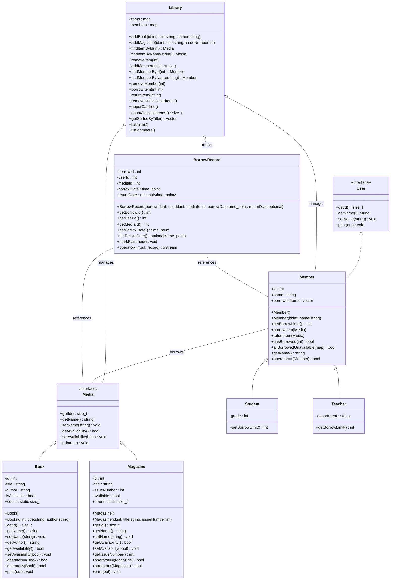

```mermaid
classDiagram
    class Media {
        <<interface>>
        +getId() size_t
        +getName() string
        +setName(string) void
        +getAvailability() bool
        +setAvailability(bool) void
        +print(out) void
    }
    class Book {
        -id : int
        -title : string
        -author : string
        -isAvailable : bool
        +count : static size_t
        +Book()
        +Book(id:int, title:string, author:string)
        +getId() size_t
        +getName() string
        +setName(string) void
        +getAuthor() string
        +getAvailability() bool
        +setAvailability(bool) void
        +operator== (Book) bool
        +operator< (Book) bool
        +print(out) void
    }
    class Magazine {
        -id : int
        -title : string
        -issueNumber : int
        -available : bool
        +count : static size_t
        +Magazine()
        +Magazine(id:int, title:string, issueNumber:int)
        +getId() size_t
        +getName() string
        +setName(string) void
        +getAvailability() bool
        +setAvailability(bool) void
        +getIssueNumber() int
        +operator== (Magazine) bool
        +operator< (Magazine) bool
        +print(out) void
    }
    class User {
        <<Interface>>
        +getId() size_t
        +getName() string
        +setName(string) void
        +print(out) void
    }
    class Member {
        +id : int
        +name : string
        +borrowedItems : vector<int>
        +Member()
        +Member(id:int, name:string)
        +getBorrowLimit() : int
        +borrowItem(Media)
        +returnItem(Media)
        +hasBorrowed(int) bool
        +allBorrowedUnavailable(map<int,Media>) bool
        +getName() string
        +operator==(Member) bool
    }
    class Student {
        -grade : int
        +getBorrowLimit() int
    }
    class Teacher {
        -department : string
        +getBorrowLimit() int
    }
    class BorrowRecord {
        -borrowId : int
        -userId : int
        -mediaId : int
        -borrowDate : time_point
        -returnDate : optional~time_point~
        +BorrowRecord(borrowId:int, userId:int, mediaId:int, borrowDate:time_point, returnDate:optional)
        +getBorrowId() int
        +getUserId() int
        +getMediaId() int
        +getBorrowDate() time_point
        +getReturnDate() optional~time_point~
        +markReturned() void
        +operator<<(out, record) ostream
    }
    class Library {
        -items : map<int, Media>
        -members : map<int, Member>
        +addBook(id:int, title:string, author:string)
        +addMagazine(id:int, title:string, issueNumber:int)
        +findItemById(int) Media
        +findItemByName(string) Media
        +removeItem(int)
        +addMember<T>(id:int, args...)
        +findMemberById(int) Member
        +findMemberByName(string) Member
        +removeMember(int)
        +borrowItem(int,int)
        +returnItem(int,int)
        +removeUnavailableItems()
        +upperCasified()
        +countAvailableItems() size_t
        +getSortedByTitle() vector<Media>
        +listItems()
        +listMembers()
    }
    %% Inheritance (is-a)
    Media <|.. Book
    Media <|.. Magazine
    Member <|-- Student
    Member <|-- Teacher
    User <|.. Member
    %% Aggregation (unfilled diamond)
    Library o-- Media : manages
    Library o-- Member : manages
    Library o-- BorrowRecord : tracks
    %% Association (straight line)
    Member -- Media : borrows
    BorrowRecord -- Member : references
    BorrowRecord -- Media : references
```