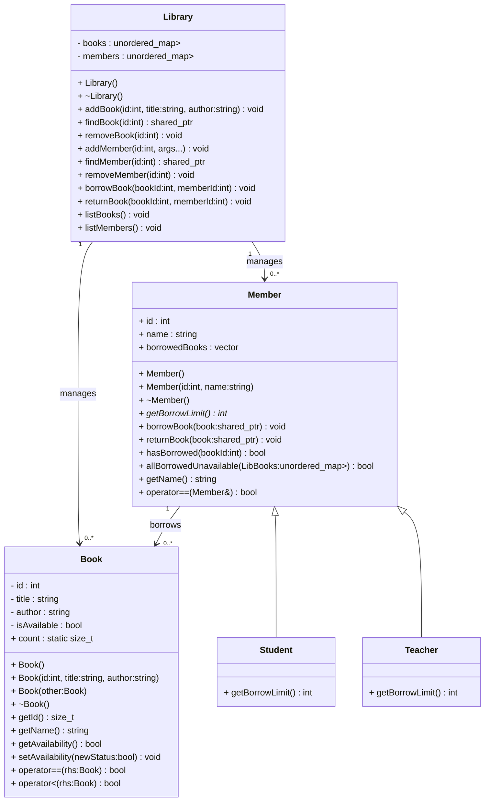
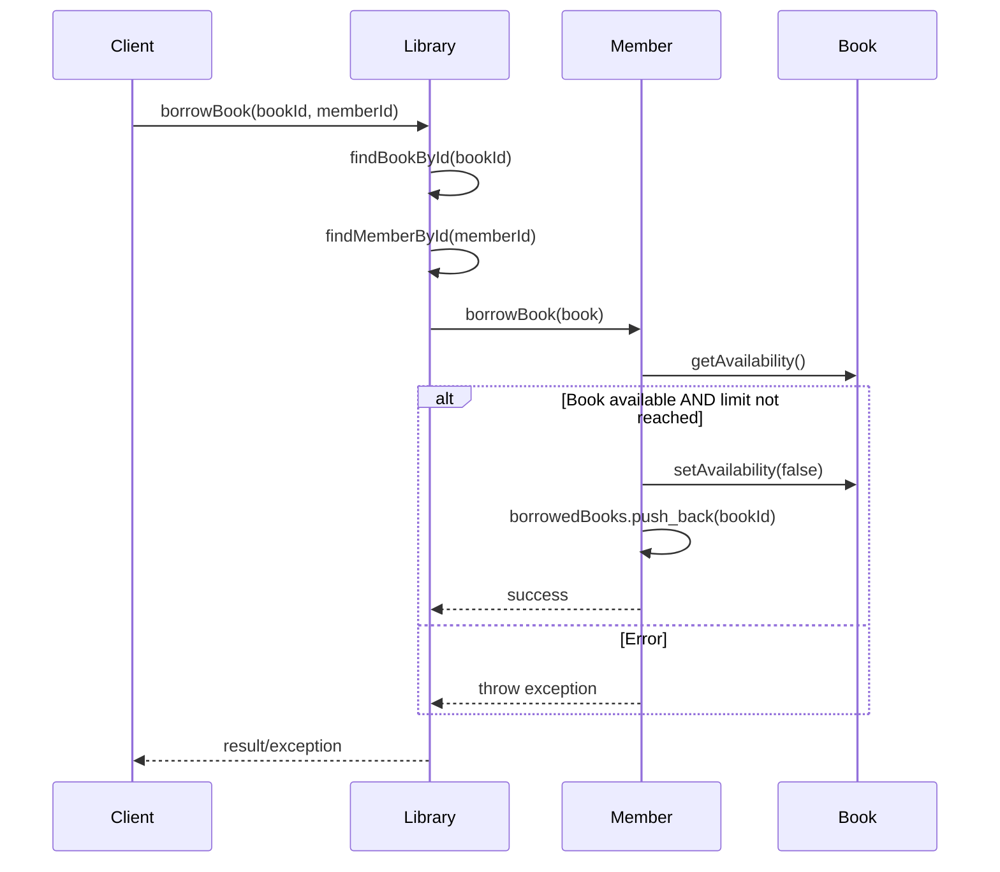
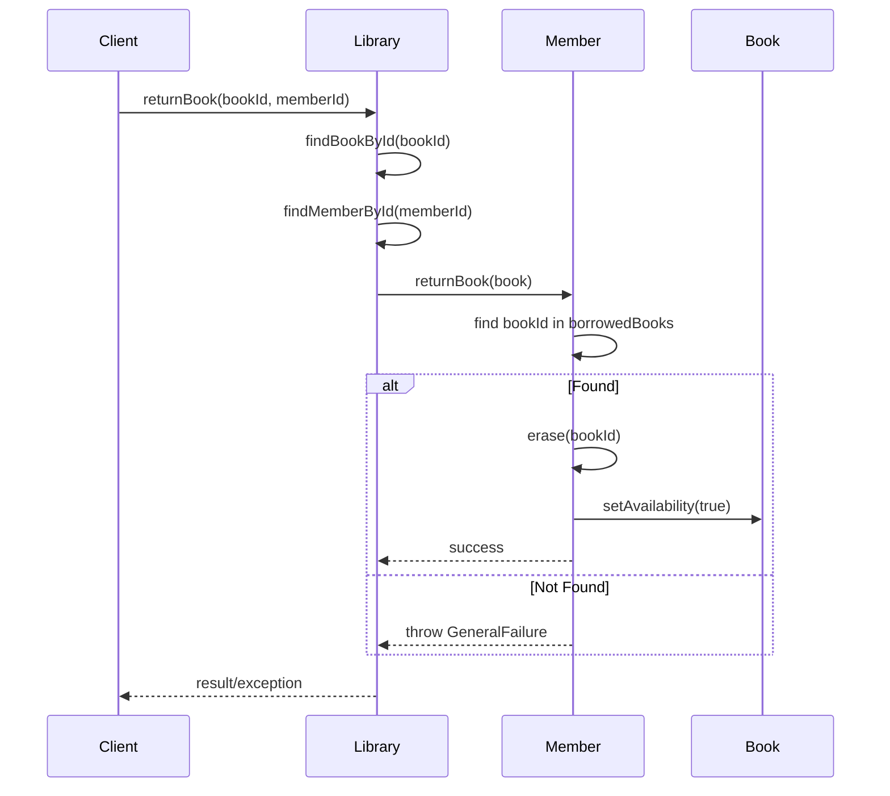
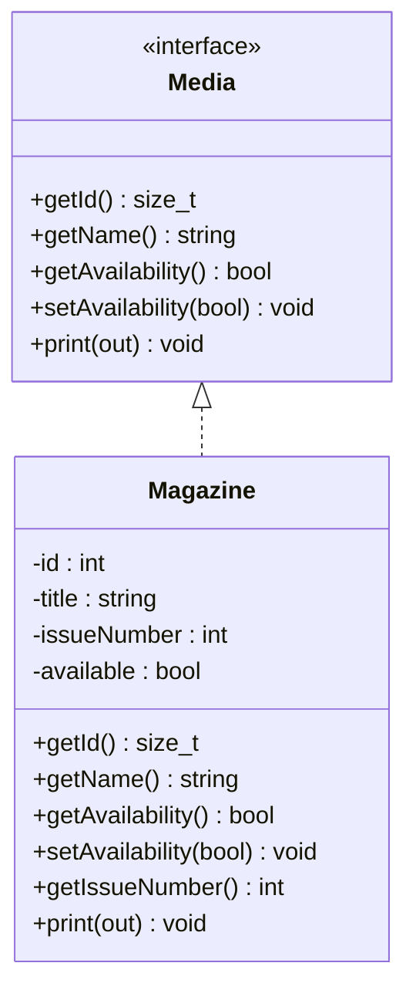
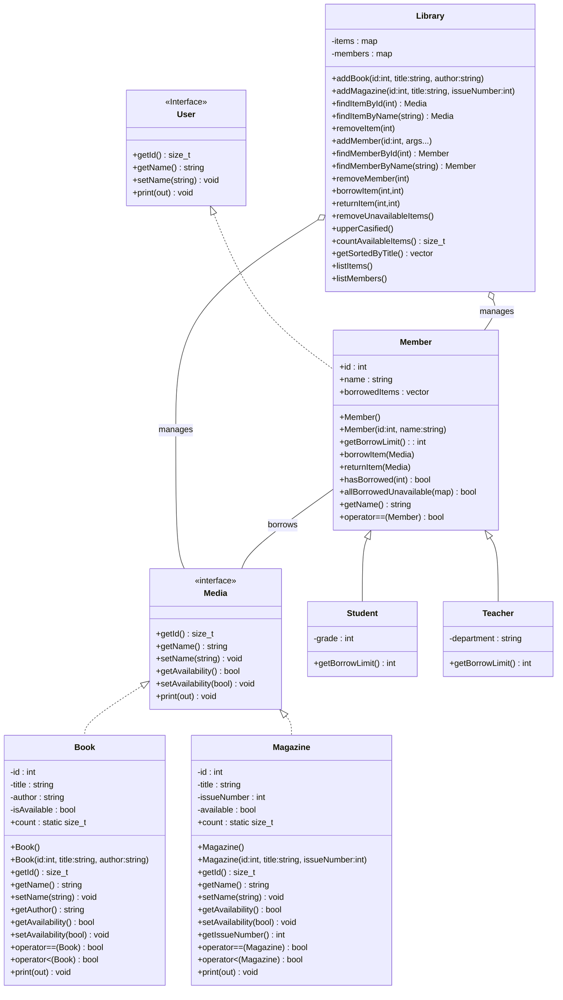
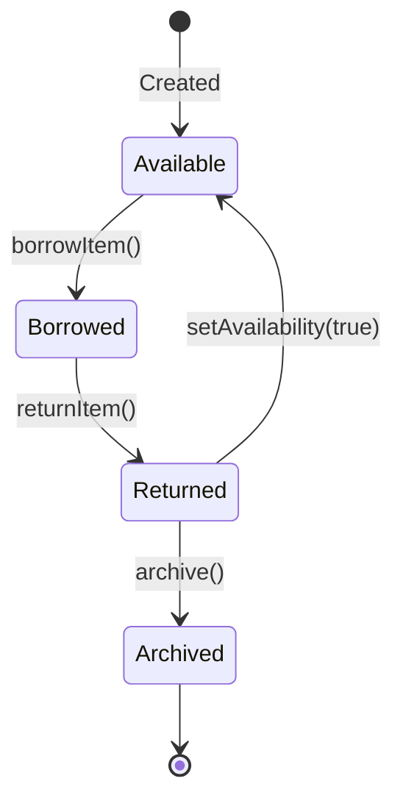
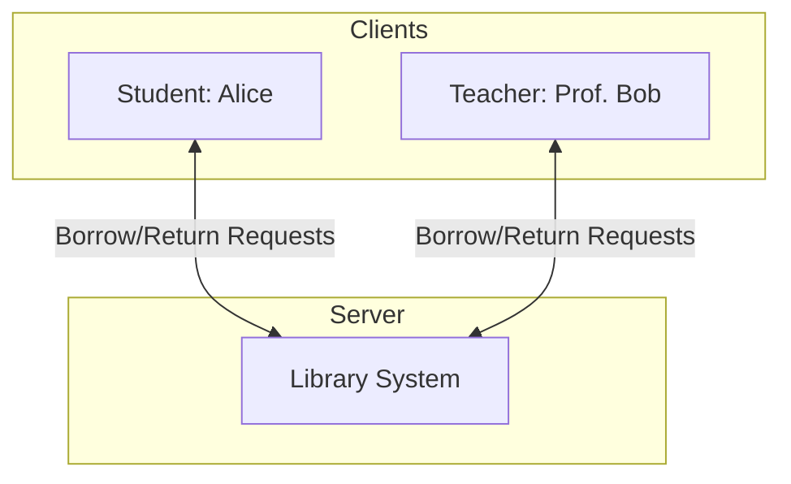

# Library Diagram

## Class Diagram v1 (End of Day 1)

## Sequence Diagrams

### borrowBook

### returnBook

## Class Diagram (Media + Magazine)

## Updated class diagram

## State Diagram for Book

## Deployment Diagram (Library server + Members as clients)

