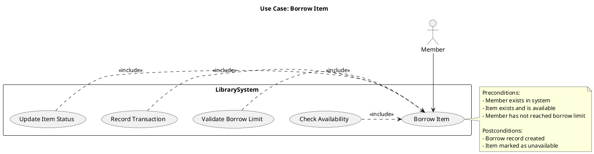
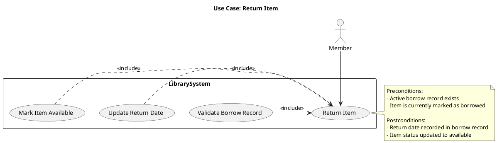

```plantuml
@startuml
title Use Case: Borrow Item

actor "Member" as Member

rectangle LibrarySystem {
    usecase "Borrow Item" as UC_Borrow
    usecase "Check Availability" as UC_CheckAvail
    usecase "Validate Borrow Limit" as UC_ValidateLimit
    usecase "Record Transaction" as UC_Record
    usecase "Update Item Status" as UC_Update
}

Member --> UC_Borrow

UC_CheckAvail .> UC_Borrow : <<include>>
UC_ValidateLimit .> UC_Borrow : <<include>>
UC_Record .> UC_Borrow : <<include>>
UC_Update .> UC_Borrow : <<include>>

note right of UC_Borrow
  Preconditions:
  - Member exists in system
  - Item exists and is available
  - Member has not reached borrow limit
  
  Postconditions:
  - Borrow record created
  - Item marked as unavailable
end note
@enduml
```

```plantuml
@startuml
title Use Case: Return Item

actor "Member" as Member

rectangle LibrarySystem {
    usecase "Return Item" as UC_Return
    usecase "Validate Borrow Record" as UC_Validate
    usecase "Update Return Date" as UC_UpdateDate
    usecase "Mark Item Available" as UC_Available
}

Member --> UC_Return

UC_Validate .> UC_Return : <<include>>
UC_UpdateDate .> UC_Return : <<include>>
UC_Available .> UC_Return : <<include>>

note right of UC_Return
  Preconditions:
  - Active borrow record exists
  - Item is currently marked as borrowed
  
  Postconditions:
  - Return date recorded in borrow record
  - Item status updated to available
end note

@enduml

```
