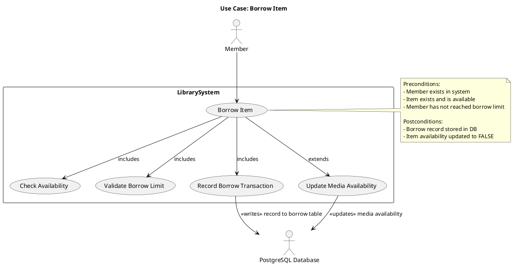
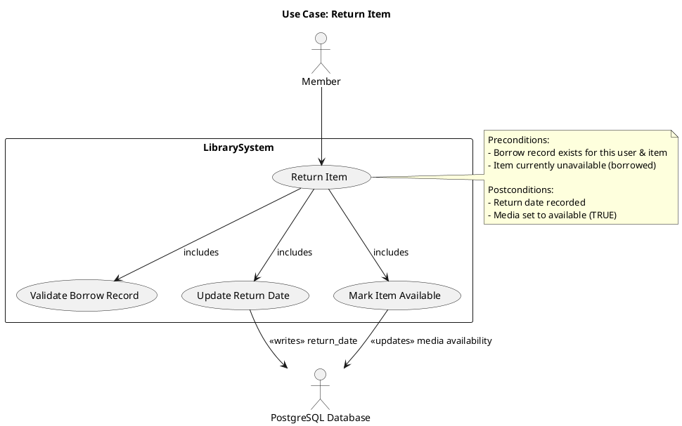

```plantuml
@startuml
title Use Case: Borrow Item

actor "Member" as Member
actor "PostgreSQL Database" as DB
rectangle LibrarySystem {
    usecase "Borrow Item" as UC_Borrow
    usecase "Check Availability" as UC_CheckAvail
    usecase "Validate Borrow Limit" as UC_ValidateLimit
    usecase "Record Borrow Transaction" as UC_Record
    usecase "Update Media Availability" as UC_Update
}

Member --> UC_Borrow
UC_Borrow --> UC_CheckAvail : includes
UC_Borrow --> UC_ValidateLimit : includes
UC_Borrow --> UC_Record : includes
UC_Record --> DB : <<writes>> record to borrow table
UC_Update --> DB : <<updates>> media availability
UC_Borrow --> UC_Update : extends

note right of UC_Borrow
  Preconditions:
  - Member exists in system
  - Item exists and is available
  - Member has not reached borrow limit

  Postconditions:
  - Borrow record stored in DB
  - Item availability updated to FALSE
end note
@enduml
```

```plantuml
@startuml
title Use Case: Return Item

actor "Member" as Member
actor "PostgreSQL Database" as DB
rectangle LibrarySystem {
    usecase "Return Item" as UC_Return
    usecase "Validate Borrow Record" as UC_Validate
    usecase "Update Return Date" as UC_UpdateDate
    usecase "Mark Item Available" as UC_Available
}

Member --> UC_Return
UC_Return --> UC_Validate : includes
UC_Return --> UC_UpdateDate : includes
UC_Return --> UC_Available : includes
UC_UpdateDate --> DB : <<writes>> return_date
UC_Available --> DB : <<updates>> media availability

note right of UC_Return
  Preconditions:
  - Borrow record exists for this user & item
  - Item currently unavailable (borrowed)

  Postconditions:
  - Return date recorded
  - Media set to available (TRUE)
end note
@enduml
```