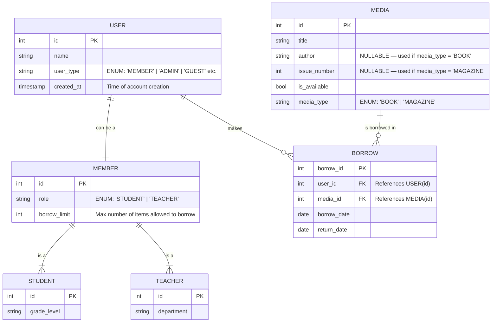

```sql
CREATE TABLE users (
    id SERIAL PRIMARY KEY,
    name TEXT NOT NULL,
    user_type TEXT DEFAULT 'MEMBER' CHECK (user_type IN ('MEMBER','ADMIN','GUEST')),
    created_at TIMESTAMP DEFAULT CURRENT_TIMESTAMP
);

CREATE TABLE members (
    id INT PRIMARY KEY REFERENCES users(id),
    role TEXT CHECK (role IN ('STUDENT','TEACHER')),
    borrow_limit INT DEFAULT 3
);

CREATE TABLE students (
    id INT PRIMARY KEY REFERENCES members(id),
    grade_level TEXT
);

CREATE TABLE teachers (
    id INT PRIMARY KEY REFERENCES members(id),
    department TEXT
);

CREATE TABLE media (
    id SERIAL PRIMARY KEY,
    title TEXT NOT NULL,
    author TEXT,
    issue_number INT,
    is_available BOOLEAN DEFAULT TRUE,
    media_type TEXT CHECK (media_type IN ('BOOK','MAGAZINE'))
);

CREATE TABLE borrow (
    borrow_id SERIAL PRIMARY KEY,
    user_id INT REFERENCES users(id),
    media_id INT REFERENCES media(id),
    borrow_date DATE DEFAULT CURRENT_DATE,
    return_date DATE
);
```