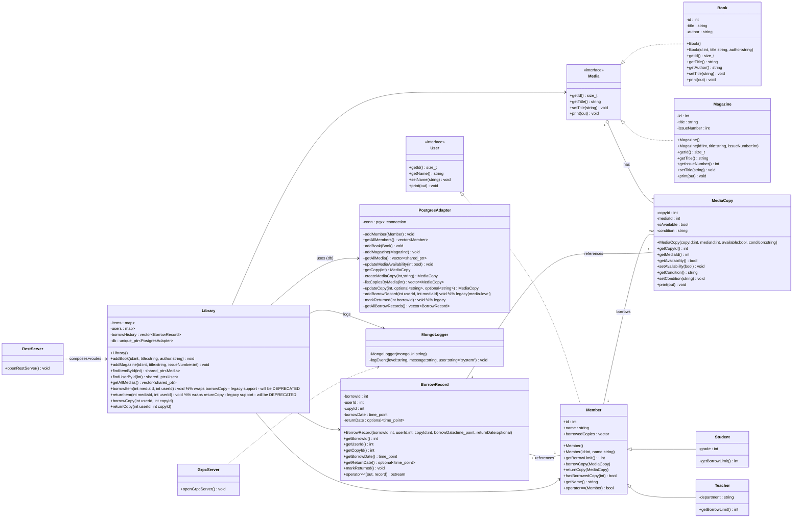

```mermaid
classDiagram
    direction LR

    %% Domain interfaces
    class Media {
        <<interface>>
        +getId() size_t
        +getTitle() string
        +setTitle(string) void
        +print(out) void
    }
    class User {
        <<interface>>
        +getId() size_t
        +getName() string
        +setName(string) void
        +print(out) void
    }

    %% Concrete media
    class Book {
        -id : int
        -title : string
        -author : string
        +Book()
        +Book(id:int, title:string, author:string)
        +getId() size_t
        +getTitle() string
        +getAuthor() string
        +setTitle(string) void
        +print(out) void
    }
    class Magazine {
        -id : int
        -title : string
        -issueNumber : int
        +Magazine()
        +Magazine(id:int, title:string, issueNumber:int)
        +getId() size_t
        +getTitle() string
        +getIssueNumber() int
        +setTitle(string) void
        +print(out) void
    }

    %% Physical copy
    class MediaCopy {
        -copyId : int
        -mediaId : int
        -isAvailable : bool
        -condition : string
        +MediaCopy(copyId:int, mediaId:int, available:bool, condition:string)
        +getCopyId() int
        +getMediaId() int
        +getAvailability() bool
        +setAvailability(bool) void
        +getCondition() string
        +setCondition(string) void
        +print(out) void
    }

    %% Members
    class Member {
        +id : int
        +name : string
        +borrowedCopies : vector<int>
        +Member()
        +Member(id:int, name:string)
        +getBorrowLimit() : int
        +borrowCopy(MediaCopy)
        +returnCopy(MediaCopy)
        +hasBorrowedCopy(int) bool
        +getName() string
        +operator==(Member) bool
    }
    class Student {
        -grade : int
        +getBorrowLimit() int
    }
    class Teacher {
        -department : string
        +getBorrowLimit() int
    }

    %% Borrow record references copy
    class BorrowRecord {
        -borrowId : int
        -userId : int
        -copyId : int
        -borrowDate : time_point
        -returnDate : optional~time_point~
        +BorrowRecord(borrowId:int, userId:int, copyId:int, borrowDate:time_point, returnDate:optional)
        +getBorrowId() int
        +getUserId() int
        +getCopyId() int
        +getBorrowDate() time_point
        +getReturnDate() optional~time_point~
        +markReturned() void
        +operator<<(out, record) ostream
    }

    %% Infrastructure
    class PostgresAdapter {
        -conn : pqxx::connection
        +addMember(Member) void
        +getAllMembers() vector~Member~
        +addBook(Book) void
        +addMagazine(Magazine) void
        +getAllMedia() vector~shared_ptr<Media>~
        +updateMediaAvailability(int,bool) void
        +getCopy(int) MediaCopy
        +createMediaCopy(int,string) MediaCopy
        +listCopiesByMedia(int) vector~MediaCopy~
        +updateCopy(int, optional~string~, optional~string~) MediaCopy
        +addBorrowRecord(int userId, int mediaId) void     %% legacy (media-level)
        +markReturned(int borrowId) void                   %% legacy
        +getAllBorrowRecords() vector~BorrowRecord~
    }

    class MongoLogger {
        +MongoLogger(mongoUrl:string)
        +logEvent(level:string, message:string, user:string="system") void
    }

    %% Application/service layer
    class Library {
        -items : map<int, shared_ptr<Media>>
        -users : map<int, shared_ptr<Member>>
        -borrowHistory : vector~BorrowRecord~
        -db : unique_ptr~PostgresAdapter~
        +Library()
        +addBook(id:int, title:string, author:string) void
        +addMagazine(id:int, title:string, issueNumber:int) void
        +findItemById(int) shared_ptr~Media~
        +findUserById(int) shared_ptr~User~
        +getAllMedias() vector~shared_ptr<Media>~
        +borrowItem(int mediaId, int userId) void          %% wraps borrowCopy - legacy support - will be DEPRECATED
        +returnItem(int mediaId, int userId) void          %% wraps returnCopy - legacy support - will be DEPRECATED
        +borrowCopy(int userId, int copyId) 
        +returnCopy(int userId, int copyId)
    }

    class RestServer {
        +openRestServer() void
    }
    class GrpcServer {
        +openGrpcServer() void
    }

    %% Inheritance
    Media <|.. Book
    Media <|.. Magazine
    User <|.. Member
    Member <|-- Student
    Member <|-- Teacher

    %% Aggregations / associations
    Media "1" o-- "many" MediaCopy : has
    Member "1" -- "many" MediaCopy : borrows
    BorrowRecord "1" -- "1" MediaCopy : references
    BorrowRecord "1" -- "1" Member : references

    Library --> PostgresAdapter : uses (db)
    Library --> MongoLogger : logs
    Library --> Media
    Library --> Member
    Library --> BorrowRecord

    RestServer ..> Library : composes+routes
    GrpcServer ..> MongoLogger : reads logs
```
