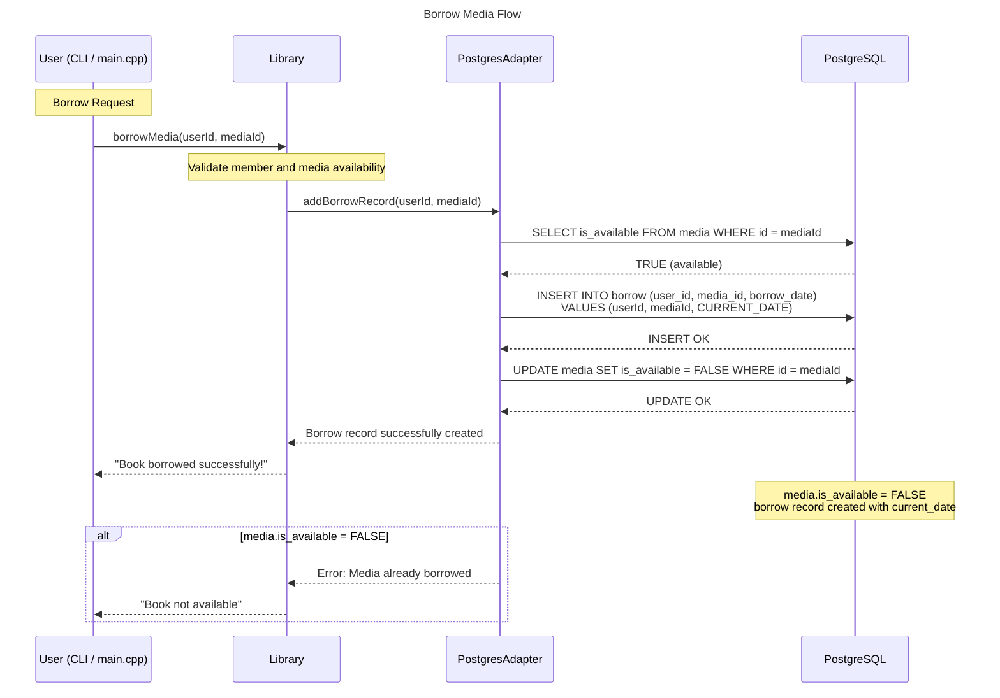
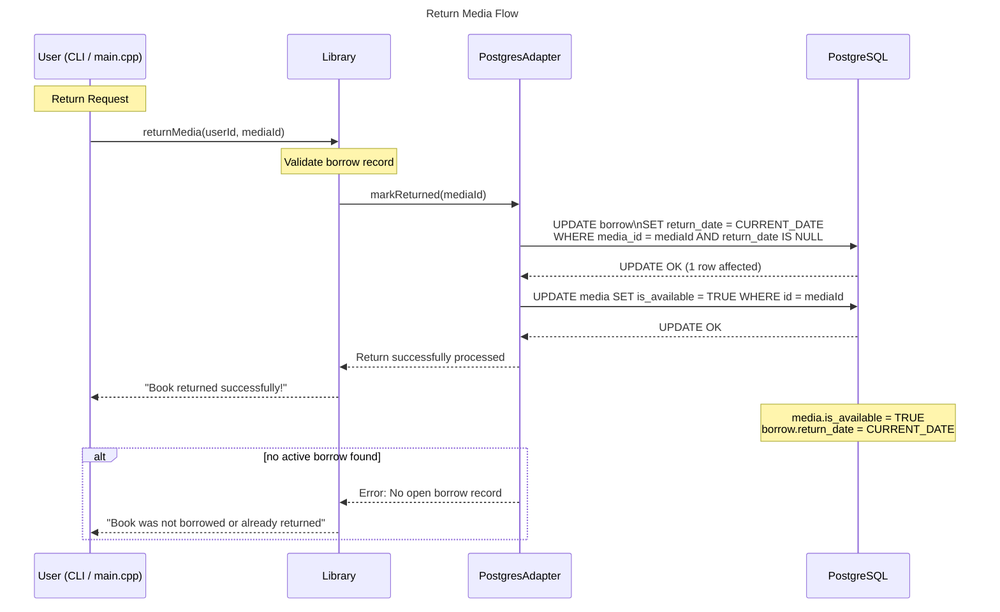

```mermaid
sequenceDiagram
    title Borrow Media Flow
    participant U as User (CLI / main.cpp)
    participant L as Library
    participant A as PostgresAdapter
    participant DB as PostgreSQL

    Note over U: Borrow Request
    U->>L: borrowMedia(userId, mediaId)

    Note over L: Validate member and media availability
    L->>A: addBorrowRecord(userId, mediaId)

    A->>DB: SELECT is_available FROM media WHERE id = mediaId
    DB-->>A: TRUE (available)

    A->>DB: INSERT INTO borrow (user_id, media_id, borrow_date)<br/>VALUES (userId, mediaId, CURRENT_DATE)
    DB-->>A: INSERT OK

    A->>DB: UPDATE media SET is_available = FALSE WHERE id = mediaId
    DB-->>A: UPDATE OK

    A-->>L: Borrow record successfully created
    L-->>U: "Book borrowed successfully!"

    Note over DB: media.is_available = FALSE<br/>borrow record created with current_date

    %% --- Error Cases ---
    alt media.is_available = FALSE
        A-->>L: Error: Media already borrowed
        L-->>U: "Book not available"
    end
```

```mermaid
sequenceDiagram
    title Return Media Flow
    participant U as User (CLI / main.cpp)
    participant L as Library
    participant A as PostgresAdapter
    participant DB as PostgreSQL

    Note over U: Return Request
    U->>L: returnMedia(userId, mediaId)

    Note over L: Validate borrow record
    L->>A: markReturned(mediaId)

    A->>DB: UPDATE borrow\nSET return_date = CURRENT_DATE<br/>WHERE media_id = mediaId AND return_date IS NULL
    DB-->>A: UPDATE OK (1 row affected)

    A->>DB: UPDATE media SET is_available = TRUE WHERE id = mediaId
    DB-->>A: UPDATE OK

    A-->>L: Return successfully processed
    L-->>U: "Book returned successfully!"

    Note over DB: media.is_available = TRUE<br/>borrow.return_date = CURRENT_DATE

    %% --- Error Cases ---
    alt no active borrow found
        A-->>L: Error: No open borrow record
        L-->>U: "Book was not borrowed or already returned"
    end
```