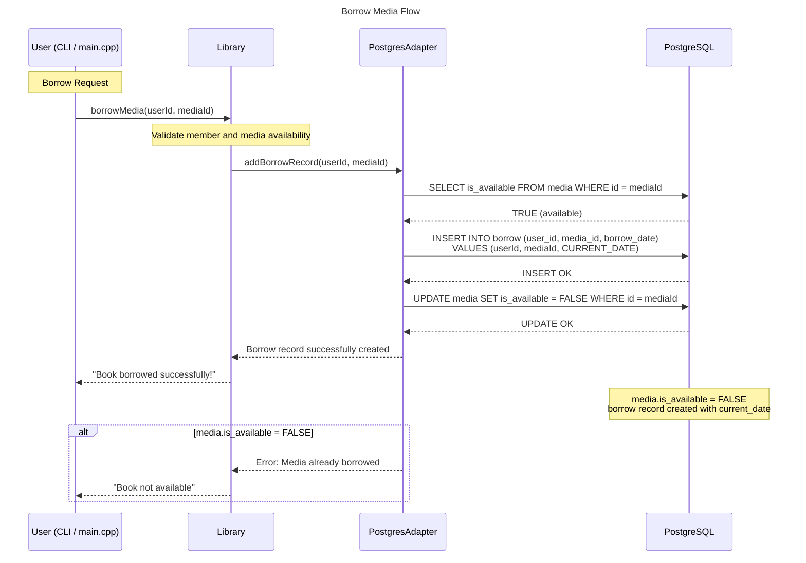
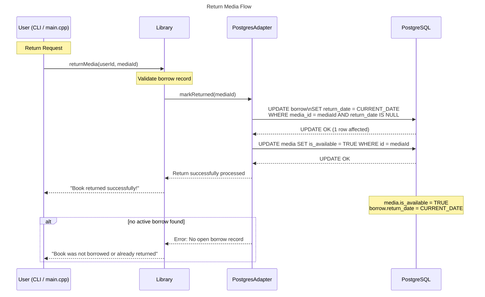
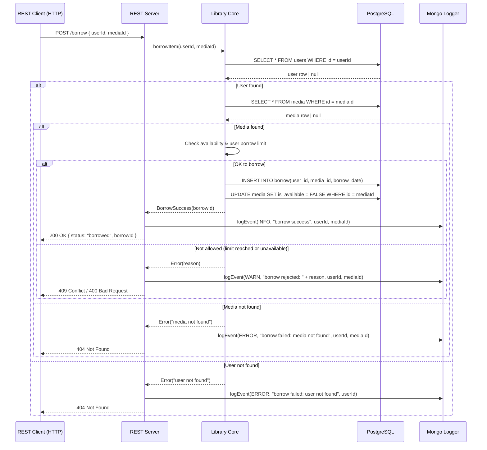
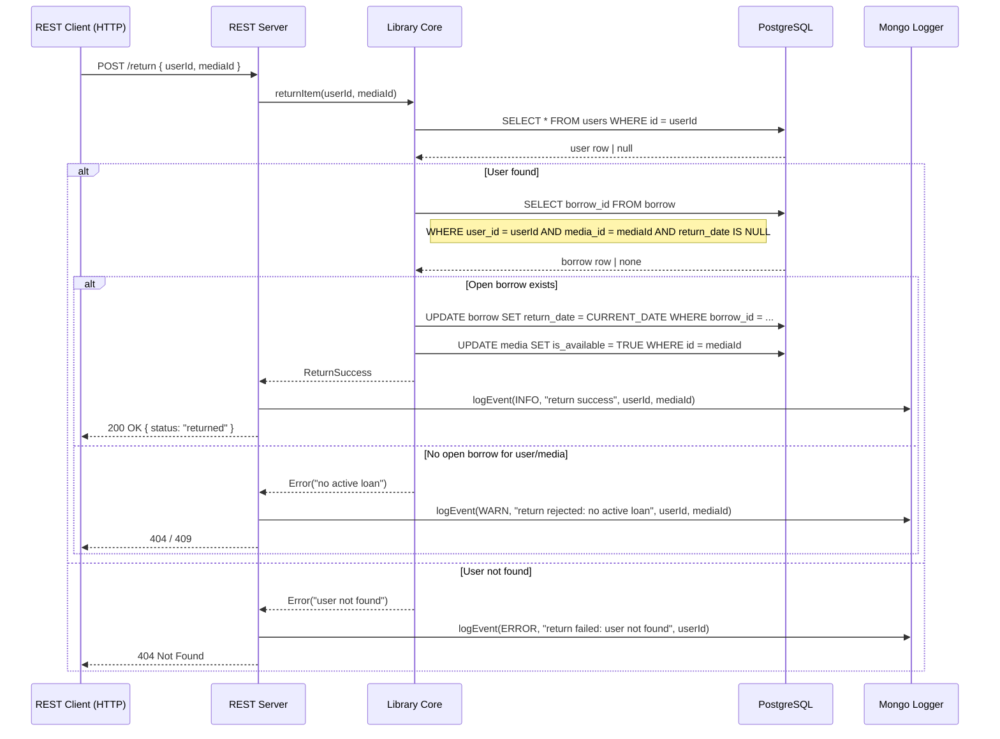

```mermaid
sequenceDiagram
    title Borrow Media Flow
    participant U as User (CLI / main.cpp)
    participant L as Library
    participant A as PostgresAdapter
    participant DB as PostgreSQL

    Note over U: Borrow Request
    U->>L: borrowMedia(userId, mediaId)

    Note over L: Validate member and media availability
    L->>A: addBorrowRecord(userId, mediaId)

    A->>DB: SELECT is_available FROM media WHERE id = mediaId
    DB-->>A: TRUE (available)

    A->>DB: INSERT INTO borrow (user_id, media_id, borrow_date)<br/>VALUES (userId, mediaId, CURRENT_DATE)
    DB-->>A: INSERT OK

    A->>DB: UPDATE media SET is_available = FALSE WHERE id = mediaId
    DB-->>A: UPDATE OK

    A-->>L: Borrow record successfully created
    L-->>U: "Book borrowed successfully!"

    Note over DB: media.is_available = FALSE<br/>borrow record created with current_date

    %% --- Error Cases ---
    alt media.is_available = FALSE
        A-->>L: Error: Media already borrowed
        L-->>U: "Book not available"
    end
```

```mermaid
sequenceDiagram
    title Return Media Flow
    participant U as User (CLI / main.cpp)
    participant L as Library
    participant A as PostgresAdapter
    participant DB as PostgreSQL

    Note over U: Return Request
    U->>L: returnMedia(userId, mediaId)

    Note over L: Validate borrow record
    L->>A: markReturned(mediaId)

    A->>DB: UPDATE borrow\nSET return_date = CURRENT_DATE<br/>WHERE media_id = mediaId AND return_date IS NULL
    DB-->>A: UPDATE OK (1 row affected)

    A->>DB: UPDATE media SET is_available = TRUE WHERE id = mediaId
    DB-->>A: UPDATE OK

    A-->>L: Return successfully processed
    L-->>U: "Book returned successfully!"

    Note over DB: media.is_available = TRUE<br/>borrow.return_date = CURRENT_DATE

    %% --- Error Cases ---
    alt no active borrow found
        A-->>L: Error: No open borrow record
        L-->>U: "Book was not borrowed or already returned"
    end
```

```mermaid
sequenceDiagram
    participant Client as REST Client (HTTP)
    participant RestAPI as REST Server
    participant Library as Library Core
    participant Postgres as PostgreSQL
    participant Mongo as Mongo Logger

    Client->>RestAPI: POST /borrow { userId, mediaId }
    RestAPI->>Library: borrowItem(userId, mediaId)

    Library->>Postgres: SELECT * FROM users WHERE id = userId
    Postgres-->>Library: user row | null

    alt User found
        Library->>Postgres: SELECT * FROM media WHERE id = mediaId
        Postgres-->>Library: media row | null

        alt Media found
            Library->>Library: Check availability & user borrow limit
            alt OK to borrow
                Library->>Postgres: INSERT INTO borrow(user_id, media_id, borrow_date)
                Library->>Postgres: UPDATE media SET is_available = FALSE WHERE id = mediaId
                Library-->>RestAPI: BorrowSuccess(borrowId)
                RestAPI->>Mongo: logEvent(INFO, "borrow success", userId, mediaId)
                RestAPI-->>Client: 200 OK { status: "borrowed", borrowId }
            else Not allowed (limit reached or unavailable)
                Library-->>RestAPI: Error(reason)
                RestAPI->>Mongo: logEvent(WARN, "borrow rejected: " + reason, userId, mediaId)
                RestAPI-->>Client: 409 Conflict / 400 Bad Request
            end
        else Media not found
            Library-->>RestAPI: Error("media not found")
            RestAPI->>Mongo: logEvent(ERROR, "borrow failed: media not found", userId, mediaId)
            RestAPI-->>Client: 404 Not Found
        end
    else User not found
        Library-->>RestAPI: Error("user not found")
        RestAPI->>Mongo: logEvent(ERROR, "borrow failed: user not found", userId)
        RestAPI-->>Client: 404 Not Found
    end
```

```mermaid
sequenceDiagram
    participant Client as REST Client (HTTP)
    participant RestAPI as REST Server
    participant Library as Library Core
    participant Postgres as PostgreSQL
    participant Mongo as Mongo Logger

    Client->>RestAPI: POST /return { userId, mediaId }
    RestAPI->>Library: returnItem(userId, mediaId)

    Library->>Postgres: SELECT * FROM users WHERE id = userId
    Postgres-->>Library: user row | null

    alt User found
        Library->>Postgres: SELECT borrow_id FROM borrow
        Note right of Library: WHERE user_id = userId AND media_id = mediaId AND return_date IS NULL
        Postgres-->>Library: borrow row | none

        alt Open borrow exists
            Library->>Postgres: UPDATE borrow SET return_date = CURRENT_DATE WHERE borrow_id = ...
            Library->>Postgres: UPDATE media SET is_available = TRUE WHERE id = mediaId
            Library-->>RestAPI: ReturnSuccess
            RestAPI->>Mongo: logEvent(INFO, "return success", userId, mediaId)
            RestAPI-->>Client: 200 OK { status: "returned" }
        else No open borrow for user/media
            Library-->>RestAPI: Error("no active loan")
            RestAPI->>Mongo: logEvent(WARN, "return rejected: no active loan", userId, mediaId)
            RestAPI-->>Client: 404 / 409
        end
    else User not found
        Library-->>RestAPI: Error("user not found")
        RestAPI->>Mongo: logEvent(ERROR, "return failed: user not found", userId)
        RestAPI-->>Client: 404 Not Found
    end
```