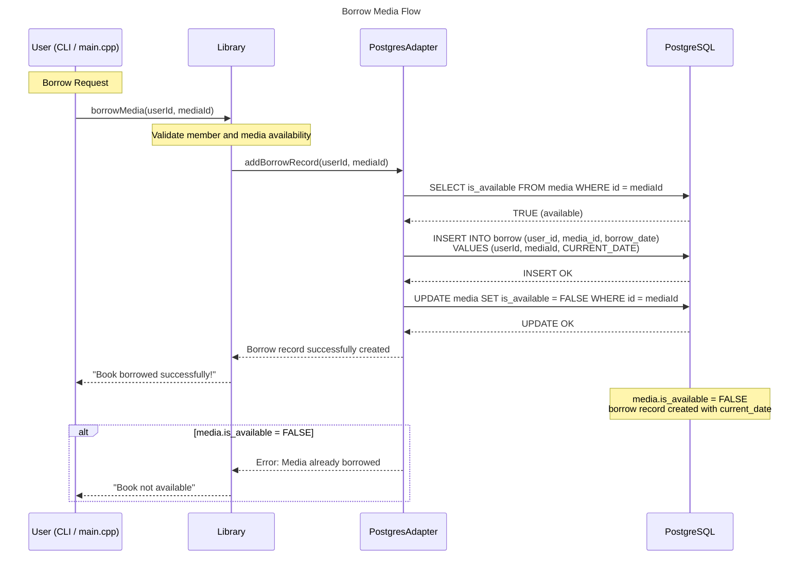
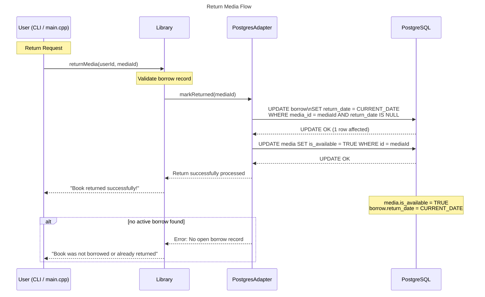
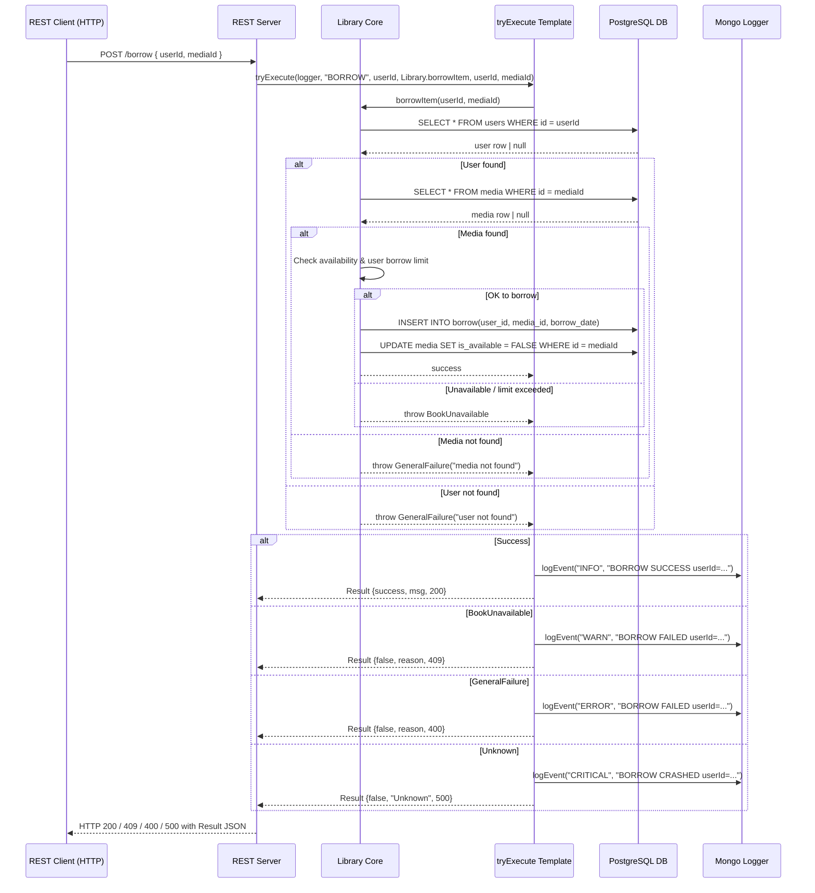
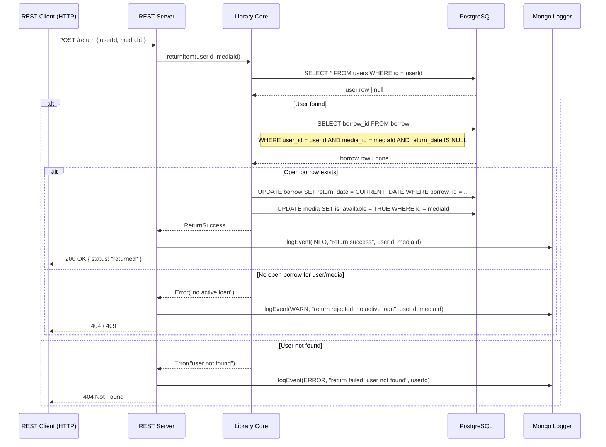
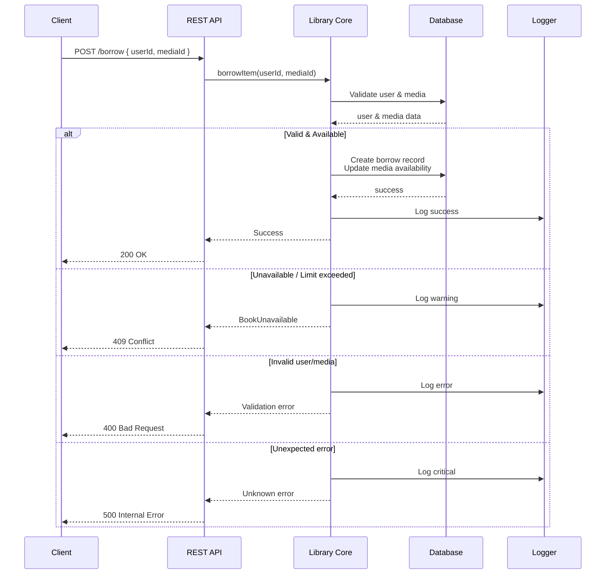

# Sequence Diagram

## Without API

### Borrow

```mermaid
sequenceDiagram
    title Borrow Media Flow
    participant U as User (CLI / main.cpp)
    participant L as Library
    participant A as PostgresAdapter
    participant DB as PostgreSQL

    Note over U: Borrow Request
    U->>L: borrowMedia(userId, mediaId)

    Note over L: Validate member and media availability
    L->>A: addBorrowRecord(userId, mediaId)

    A->>DB: SELECT is_available FROM media WHERE id = mediaId
    DB-->>A: TRUE (available)

    A->>DB: INSERT INTO borrow (user_id, media_id, borrow_date)<br/>VALUES (userId, mediaId, CURRENT_DATE)
    DB-->>A: INSERT OK

    A->>DB: UPDATE media SET is_available = FALSE WHERE id = mediaId
    DB-->>A: UPDATE OK

    A-->>L: Borrow record successfully created
    L-->>U: "Book borrowed successfully!"

    Note over DB: media.is_available = FALSE<br/>borrow record created with current_date

    %% --- Error Cases ---
    alt media.is_available = FALSE
        A-->>L: Error: Media already borrowed
        L-->>U: "Book not available"
    end
```

### Return

```mermaid
sequenceDiagram
    title Return Media Flow
    participant U as User (CLI / main.cpp)
    participant L as Library
    participant A as PostgresAdapter
    participant DB as PostgreSQL

    Note over U: Return Request
    U->>L: returnMedia(userId, mediaId)

    Note over L: Validate borrow record
    L->>A: markReturned(mediaId)

    A->>DB: UPDATE borrow\nSET return_date = CURRENT_DATE<br/>WHERE media_id = mediaId AND return_date IS NULL
    DB-->>A: UPDATE OK (1 row affected)

    A->>DB: UPDATE media SET is_available = TRUE WHERE id = mediaId
    DB-->>A: UPDATE OK

    A-->>L: Return successfully processed
    L-->>U: "Book returned successfully!"

    Note over DB: media.is_available = TRUE<br/>borrow.return_date = CURRENT_DATE

    %% --- Error Cases ---
    alt no active borrow found
        A-->>L: Error: No open borrow record
        L-->>U: "Book was not borrowed or already returned"
    end
```
---

## Detailed with API and Ultis

### POST /borrow

```mermaid
sequenceDiagram
    participant Client as REST Client (HTTP)
    participant RestAPI as REST Server
    participant Library as Library Core
    participant TryExec as tryExecute Template
    participant Postgres as PostgreSQL DB
    participant Mongo as Mongo Logger

    Client->>RestAPI: POST /borrow { userId, mediaId }
    RestAPI->>TryExec: tryExecute(logger, "BORROW", userId, Library.borrowItem, userId, mediaId)
    
    TryExec->>Library: borrowItem(userId, mediaId)
    Library->>Postgres: SELECT * FROM users WHERE id = userId
    Postgres-->>Library: user row | null

    alt User found
        Library->>Postgres: SELECT * FROM media WHERE id = mediaId
        Postgres-->>Library: media row | null

        alt Media found
            Library->>Library: Check availability & user borrow limit
            alt OK to borrow
                Library->>Postgres: INSERT INTO borrow(user_id, media_id, borrow_date)
                Library->>Postgres: UPDATE media SET is_available = FALSE WHERE id = mediaId
                Library-->>TryExec: success
            else Unavailable / limit exceeded
                Library-->>TryExec: throw BookUnavailable
            end
        else Media not found
            Library-->>TryExec: throw GeneralFailure("media not found")
        end
    else User not found
        Library-->>TryExec: throw GeneralFailure("user not found")
    end

    alt Success
        TryExec->>Mongo: logEvent("INFO", "BORROW SUCCESS userId=...")
        TryExec-->>RestAPI: Result {success, msg, 200}
    else BookUnavailable
        TryExec->>Mongo: logEvent("WARN", "BORROW FAILED userId=...")
        TryExec-->>RestAPI: Result {false, reason, 409}
    else GeneralFailure
        TryExec->>Mongo: logEvent("ERROR", "BORROW FAILED userId=...")
        TryExec-->>RestAPI: Result {false, reason, 400}
    else Unknown
        TryExec->>Mongo: logEvent("CRITICAL", "BORROW CRASHED userId=...")
        TryExec-->>RestAPI: Result {false, "Unknown", 500}
    end

    RestAPI-->>Client: HTTP 200 / 409 / 400 / 500 with Result JSON

```

### POST /return

```mermaid
sequenceDiagram
    participant Client as REST Client (HTTP)
    participant RestAPI as REST Server
    participant Library as Library Core
    participant Postgres as PostgreSQL
    participant Mongo as Mongo Logger

    Client->>RestAPI: POST /return { userId, mediaId }
    RestAPI->>Library: returnItem(userId, mediaId)

    Library->>Postgres: SELECT * FROM users WHERE id = userId
    Postgres-->>Library: user row | null

    alt User found
        Library->>Postgres: SELECT borrow_id FROM borrow
        Note right of Library: WHERE user_id = userId AND media_id = mediaId AND return_date IS NULL
        Postgres-->>Library: borrow row | none

        alt Open borrow exists
            Library->>Postgres: UPDATE borrow SET return_date = CURRENT_DATE WHERE borrow_id = ...
            Library->>Postgres: UPDATE media SET is_available = TRUE WHERE id = mediaId
            Library-->>RestAPI: ReturnSuccess
            RestAPI->>Mongo: logEvent(INFO, "return success", userId, mediaId)
            RestAPI-->>Client: 200 OK { status: "returned" }
        else No open borrow for user/media
            Library-->>RestAPI: Error("no active loan")
            RestAPI->>Mongo: logEvent(WARN, "return rejected: no active loan", userId, mediaId)
            RestAPI-->>Client: 404 / 409
        end
    else User not found
        Library-->>RestAPI: Error("user not found")
        RestAPI->>Mongo: logEvent(ERROR, "return failed: user not found", userId)
        RestAPI-->>Client: 404 Not Found
    end
```

## Simplified version

```mermaid
sequenceDiagram
    participant Client
    participant REST API
    participant Library Core
    participant Database
    participant Logger

    Client->>REST API: POST /borrow { userId, mediaId }
    REST API->>Library Core: borrowItem(userId, mediaId)
    
    Library Core->>Database: Validate user & media
    Database-->>Library Core: user & media data
    
    alt Valid & Available
        Library Core->>Database: Create borrow record<br/>Update media availability
        Database-->>Library Core: success
        Library Core->>Logger: Log success
        Library Core-->>REST API: Success
        REST API-->>Client: 200 OK
    else Unavailable / Limit exceeded
        Library Core->>Logger: Log warning
        Library Core-->>REST API: BookUnavailable
        REST API-->>Client: 409 Conflict
    else Invalid user/media
        Library Core->>Logger: Log error
        Library Core-->>REST API: Validation error
        REST API-->>Client: 400 Bad Request
    else Unexpected error
        Library Core->>Logger: Log critical
        Library Core-->>REST API: Unknown error
        REST API-->>Client: 500 Internal Error
    end
```