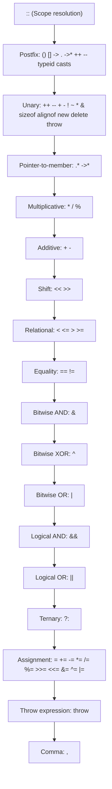

```mermaid
graph TD
    A[":: (Scope resolution)"] --> B["Postfix: () [] -> . ->* ++ -- typeid casts"]
    B --> C["Unary: ++ -- + - ! ~ * & sizeof alignof new delete throw"]
    C --> D["Pointer-to-member: .* ->*"]
    D --> E["Multiplicative: * / %"]
    E --> F["Additive: + -"]
    F --> G["Shift: << >>"]
    G --> H["Relational: < <= > >="]
    H --> I["Equality: == !="]
    I --> J["Bitwise AND: &"]
    J --> K["Bitwise XOR: ^"]
    K --> L["Bitwise OR: |"]
    L --> M["Logical AND: &&"]
    M --> N["Logical OR: ||"]
    N --> O["Ternary: ?:"]
    O --> P["Assignment: = += -= *= /= %= >>= <<= &= ^= |="]
    P --> Q["Throw expression: throw"]
    Q --> R["Comma: ,"]

```
