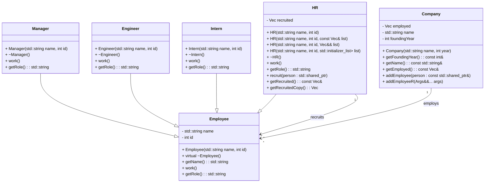

# Class Diagram

```mermaid
classDiagram
    %% Base class
    class Employee {
        - std::string name
        - int id
        + Employee(std::string name, int id)
        + virtual ~Employee()
        + getName() : std::string
        + work()
        + getRole() : std::string
    }

    %% Derived classes
    class Manager {
        + Manager(std::string name, int id)
        + ~Manager()
        + work()
        + getRole() : std::string
    }

    class Engineer {
        + Engineer(std::string name, int id)
        + ~Engineer()
        + work()
        + getRole() : std::string
    }

    class Intern {
        + Intern(std::string name, int id)
        + ~Intern()
        + work()
        + getRole() : std::string
    }

    class HR {
        - Vec recruited
        + HR(std::string name, int id)
        + HR(std::string name, int id, const Vec& list)
        + HR(std::string name, int id, Vec&& list)
        + HR(std::string name, int id, std::initializer_list<std::shared_ptr<Employee>> list)
        + ~HR()
        + work()
        + getRole() : std::string
        + recruit(person : std::shared_ptr<Employee>)
        + getRecruited() : const Vec&
        + getRecruitedCopy() : Vec
    }

    class Company {
        - Vec employed
        - std::string name
        - int foundingYear
        + Company(std::string name, int year)
        + getFoundingYear() : const int&
        + getName() : const std::string&
        + getEmployed() : const Vec&
        + addEmployee(person : const std::shared_ptr<Employee>&)
        + addEmployeeR<T, Args...>(Args&&... args)
    }

    %% Inheritance relationships
    Manager --|> Employee
    Engineer --|> Employee
    Intern --|> Employee
    HR --|> Employee

    %% Association
    Company "1" --> "*" Employee : employs
    HR "1" --> "*" Employee : recruits
```