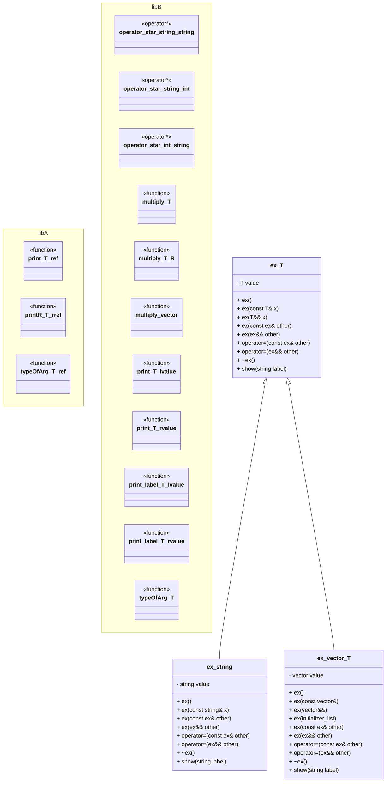

# File Structure (C++ Namespaces & Templates)

## Namespaces

### `namespace libA`
- **Functions**
  - `print(T& x)` → prints lvalue
  - `printR(T&& x)` → prints rvalue
  - `typeOfArg(T& x)` → prints type info

---

### `namespace libB`
- **Operator Overloads**
  - `string operator*(const string&, const string&)`
  - `string operator*(const string&, const int&)`
  - `string operator*(const int&, const string&)`

- **Functions**
  - `multiply(const T& x)` → returns `x * x`
  - `multiply(const T& x, const R& y)` → returns `x * y`
  - `multiply(const vector<T>& x)` → returns funny string message

- **Printing**
  - `print(T& x)` → lvalue
  - `print(T&& x)` → rvalue
  - `print(const string& label, T& x)` → labeled lvalue
  - `print(const string& label, T&& x)` → labeled rvalue
  - `typeOfArg(T& x)` → prints type info

---

## Templates

### `template <typename T> class ex`
- **Data Member**
  - `T value`

- **Constructors**
  - `ex()` → default ctor
  - `ex(const T& x)` → parameterized ctor (lvalue)
  - `ex(T&& x)` → forwarding ctor (rvalue, uses `std::forward`)
  - `ex(const ex& other)` → copy ctor
  - `ex(ex&& other)` → move ctor

- **Assignment Operators**
  - `operator=(const ex& other)` → copy assignment
  - `operator=(ex&& other)` → move assignment

- **Destructor**
  - `~ex() = default`

- **Methods**
  - `show(const string& label)` → calls `libB::print(label, value)`

---

### Specialization: `ex<std::string>`
- **Data Member**
  - `string value`

- **Constructors**
  - Default ctor → empty string
  - Parameterized ctor → `ex(const string&)`
  - Copy ctor → logs `"Call String Copy Ctor"`
  - Move ctor → logs `"Call String Move Ctor"`

- **Assignment**
  - Copy assignment
  - Move assignment

- **Methods**
  - `show(const string& label)` → prints string with length

---

### Specialization: `ex<std::vector<T>>`
- **Data Member**
  - `vector<T> value`

- **Constructors**
  - Default ctor
  - `ex(const vector<T>&)`
  - `ex(vector<T>&&)`
  - `ex(initializer_list<T>)`
  - Copy ctor → logs `"Call Vector Copy Ctor"`
  - Move ctor → logs `"Call Vector Move Ctor"`

- **Assignment**
  - Copy assignment
  - Move assignment

- **Methods**
  - `show(const string& label)` → prints vector size and contents

---
## Diagram



---
## Example Usage (from `main`)
```cpp
ex<int> C(2);
ex<int> D = C;       // copy ctor
ex<int> E = 6;       // forwarding ctor
ex<int> F = std::move(E); // move ctor

ex<std::string> G("Hello");
ex<std::string> H = G;       // copy ctor
ex<std::string> I = std::move(G); // move ctor

ex<std::vector<int>> J{1,2,3,4};
ex<std::vector<std::string>> K({"a", "b"});
```
