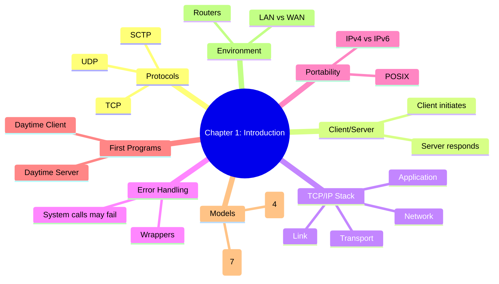

# Chapter 1 Study Notes

## Chapter 1: Introduction

---

## 📌 Summary of Chapter 1
- Client/server model is the foundation of network programming.  
- TCP/IP stack is central: Application → Transport → Network → Datalink.  
- Error handling wrappers make code cleaner and safer.  
- Standards (POSIX, BSD history) ensure portability.  
- Real-world systems differ: 32 vs 64-bit, IPv4 vs IPv6, LAN vs WAN.  
