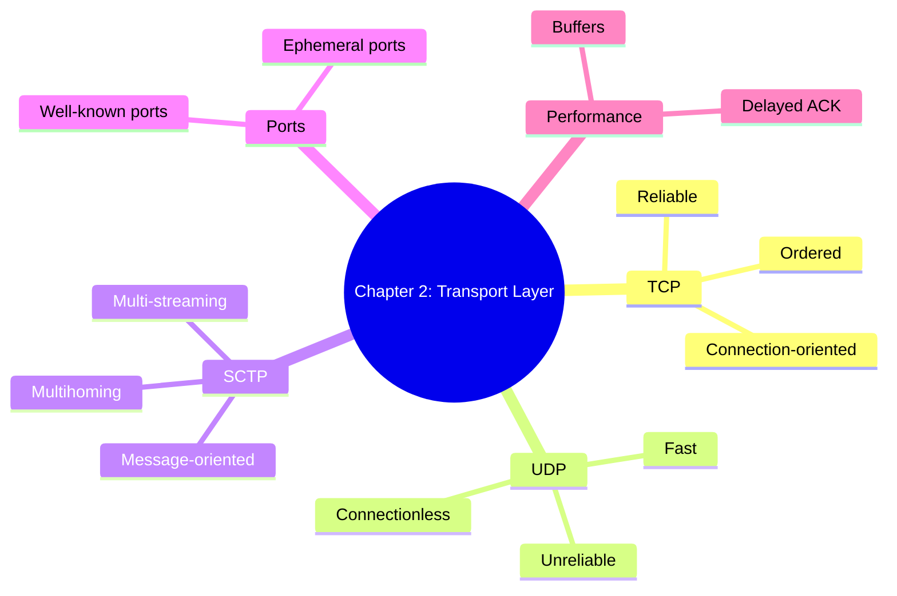
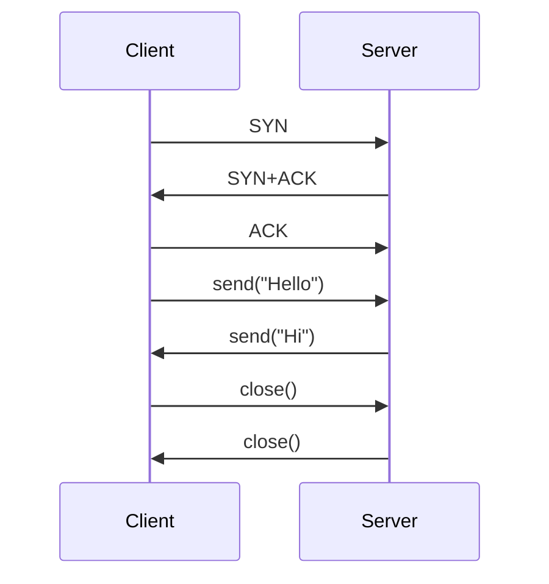
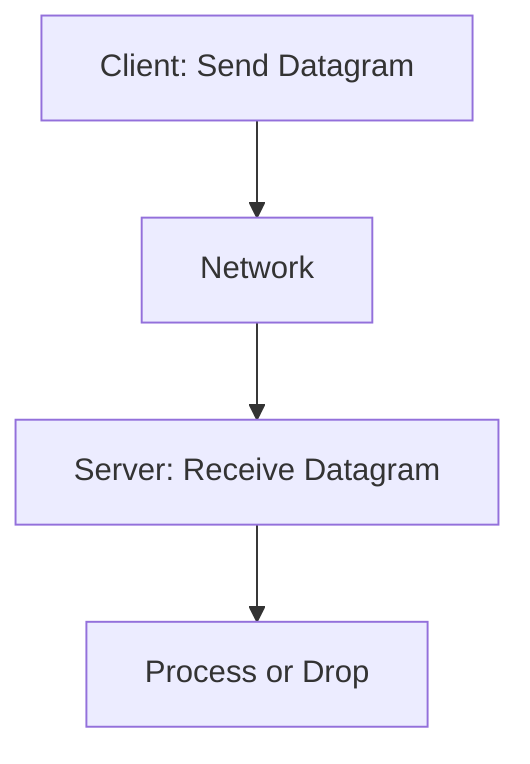
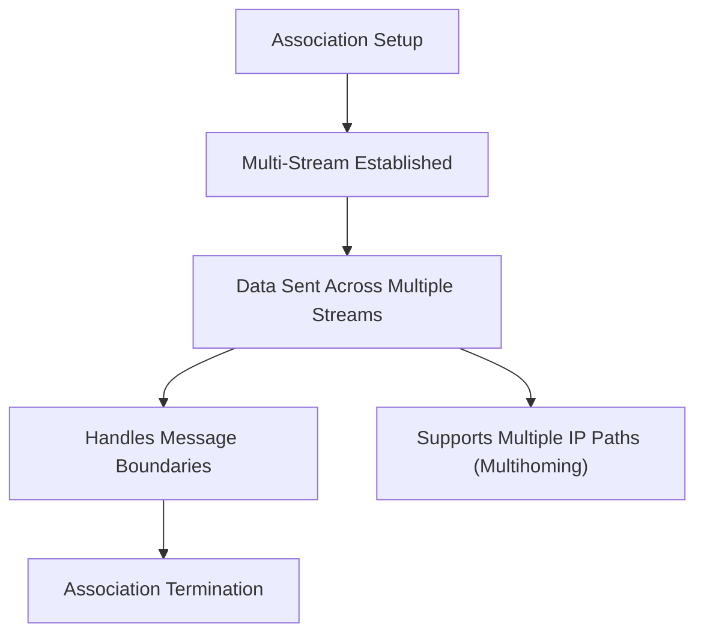

# Chapter 2 

## Mind Map

---

## Flowcharts for Protocols

### 1. TCP — Connection-Oriented & Reliable

Shows the **3-way handshake**, reliable data transfer with ACKs, and proper termination.  

---

### 2. UDP — Connectionless & Fast

No handshake, no guarantees → simple but fast.  

---

### 3. SCTP — Advanced Transport Protocol

Keeps **message boundaries**, avoids head-of-line blocking, and supports multiple IP addresses.  

---

## ✅ Summary
- **TCP** = Reliable phone call (handshake, ACKs, ordered).  
- **UDP** = Quick postcard (fast, but can be lost).  
- **SCTP** = Phone system with multiple lines (advanced features: streams + multihoming).  
