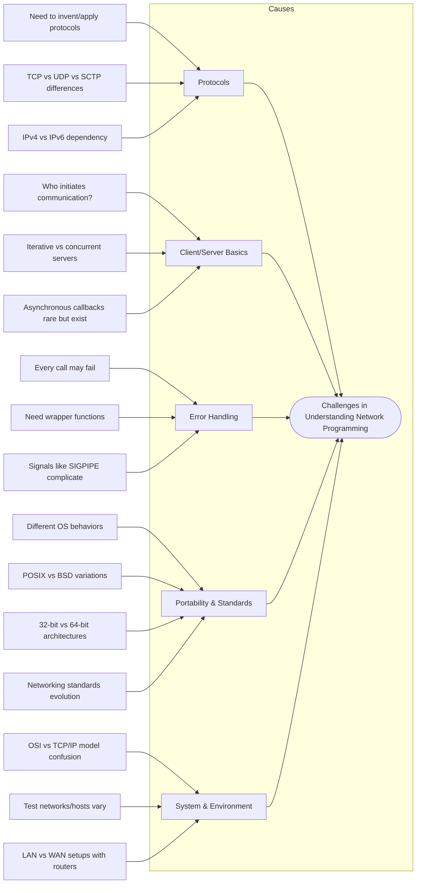

# 📘 UNIX Network Programming — Chapter 1 Study Notes

## 🐟 Fishbone Diagram — Chapter 1: Introduction

---

## ✨ Explanations

### **Protocols**
- **Need to invent/apply protocols** → Agreement on how programs communicate.  
- **TCP vs UDP vs SCTP differences** → Reliable byte stream vs connectionless datagrams vs multistreaming protocol.  
- **IPv4 vs IPv6 dependency** → Code must be updated to handle both address families; `getaddrinfo()` solves this.  

### **Client/Server Basics**
- **Who initiates communication?** → Clients always initiate; servers wait.  
- **Iterative vs concurrent servers** → Iterative handles one client at a time; concurrent uses fork/threads to handle many.  
- **Asynchronous callbacks rare but exist** → Some protocols allow servers to push data to clients.  

### **Error Handling**
- **Every call may fail** → Must check all socket and I/O calls.  
- **Need wrapper functions** → Simplify error checking (e.g., `Socket()`, `Connect()`).  
- **Signals like SIGPIPE complicate** → Writing to a closed socket can raise SIGPIPE.  

### **Portability & Standards**
- **Different OS behaviors** → Slight variations between UNIX flavors.  
- **POSIX vs BSD variations** → POSIX standardizes, BSD influenced sockets.  
- **32-bit vs 64-bit architectures** → Data type size issues affect portability.  
- **Networking standards evolution** → APIs updated over time (e.g., POSIX 2001).  

### **System & Environment**
- **OSI vs TCP/IP model confusion** → 7-layer OSI vs 4-layer TCP/IP.  
- **Test networks/hosts vary** → Examples tested across Solaris, Linux, FreeBSD, etc.  
- **LAN vs WAN setups with routers** → Understanding topology is key.  

---

## 📌 Summary of Chapter 1
- Client/server model is the foundation of network programming.  
- TCP/IP stack is central: Application → Transport → Network → Datalink.  
- Error handling wrappers make code cleaner and safer.  
- Standards (POSIX, BSD history) ensure portability.  
- Real-world systems differ: 32 vs 64-bit, IPv4 vs IPv6, LAN vs WAN.  
